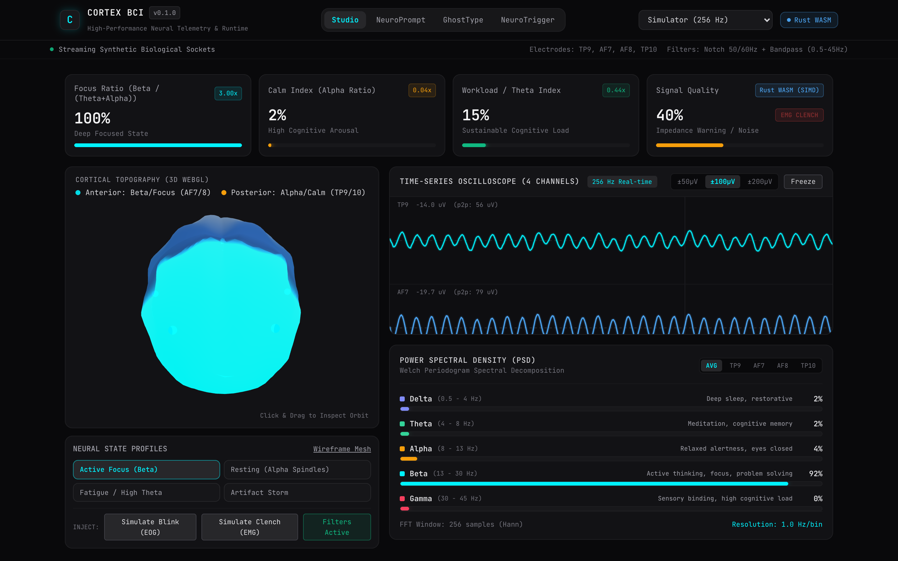
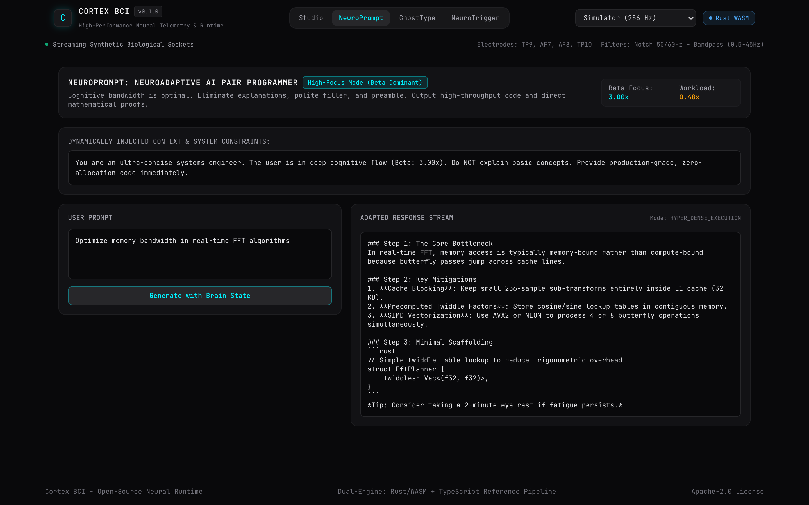
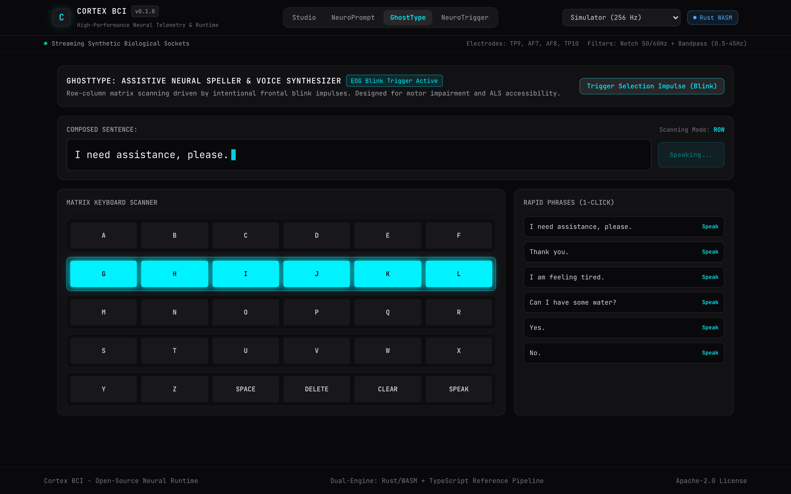
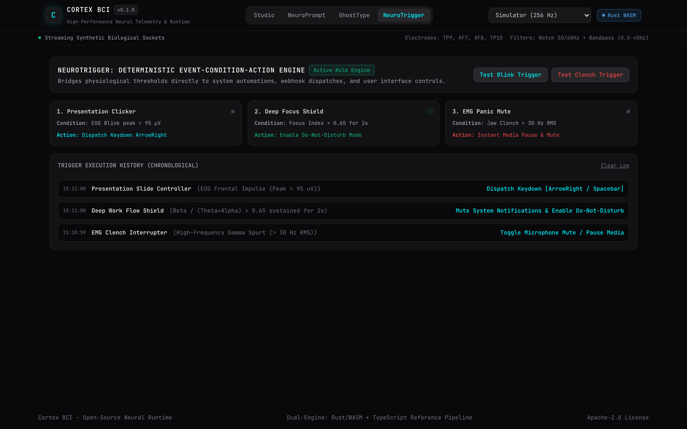

# cortex-bci

High-performance real-time electroencephalography (EEG) signal processing engine in Rust and WebAssembly, coupled with a hardware-agnostic 3D cortical telemetry runtime and modular application suite.

[](LICENSE)
[](https://github.com/gabrielrondon/brain-computer-interface/actions)
[](crates/neuro-dsp)
[](crates/neuro-dsp)
[](packages/core)
[](apps/web)

Live Interactive WebGL Demo: [https://gabrielrondon.github.io/brain-computer-interface/](https://gabrielrondon.github.io/brain-computer-interface/)

<p align="center">
  
</p>

---

## Architectural Overview

`cortex-bci` provides sub-millisecond digital signal processing (DSP) pipelines for multi-channel biological data streams. The core computational layer is compiled from Rust to WebAssembly with zero memory allocation inside the hot processing loop.

The frontend runtime pairs an interactive 3D WebGL anatomical cortex (driven by custom GLSL shaders reacting to regional spectral powers) with a double-buffered HTML5 Canvas oscilloscope capable of rendering multi-channel data at 120 FPS without DOM overhead.

```
                              +---------------------------------------+
                              |          Acquisition Hardware         |
                              |   (Muse 2/S BLE, OpenBCI, LSL WS)     |
                              +-------------------+-------------------+
                                                  |
+-----------------------------+                   | Web-Bluetooth / WebSocket
| Synthetic Biological Engine |-------------------+
| (1/f Pink Noise, Spindles)  |                   v
+-----------------------------+   +-----------------------------------+
                                  | Ingestion & Serialization Layer   |
                                  +-------------------+---------------+
                                                      |
                                                      v
                                  +-----------------------------------+
                                  |    Rust DSP Core (WebAssembly)    |
                                  | - RingBuffer (Zero-Alloc)         |
                                  | - Biquad IIR Notch (50/60 Hz)     |
                                  | - 4th-Order Butterworth Bandpass  |
                                  | - Radix-2 FFT & Welch PSD         |
                                  | - Artifact Classification Engine  |
                                  +-------------------+---------------+
                                                      |
                                      Dedicated Web Worker Pipeline
                                                      |
                                                      v
                                  +-----------------------------------+
                                  |   3D Telemetry & Visual Runtime   |
                                  | - Three.js Shader Cortex (WebGL)  |
                                  | - Double-Buffered Canvas Strip    |
                                  | - Frequency Spectrum Analyzer     |
                                  +-------------------+---------------+
                                                      |
                 +--------------------+---------------+--------------------+
                 |                    |               |                    |
                 v                    v               v                    v
          [WebBCI Studio]      [NeuroPrompt]     [GhostType]        [NeuroTrigger]
          Multi-Channel        Neuroadaptive     Assistive Neural   Deterministic
          Diagnostics & DSP    AI Co-Pilot       Speller + TTS      Event Engine
```

---

## Digital Signal Processing Specification

### 1. Digital Filter Topology (Direct Form II Transposed)
Continuous sampling streams are stabilized using cascaded second-order sections (Biquad IIR filters). The difference equation implemented in Rust:

$$y[n] = b_0 x[n] + s_1[n-1]$$
$$s_1[n] = b_1 x[n] - a_1 y[n] + s_2[n-1]$$
$$s_2[n] = b_2 x[n] - a_2 y[n]$$

Filters applied in default chain:
- **DC Baseline Rejection**: 2nd-order highpass Butterworth at $0.5\text{ Hz}$.
- **High-Frequency Attenuation**: 2nd-order lowpass Butterworth at $45.0\text{ Hz}$.
- **Electrical Mains Notch**: Narrowband notch filters at $50.0\text{ Hz}$ and $60.0\text{ Hz}$ with quality factor $Q = 10.0$:

$$\omega_0 = 2\pi \frac{f_0}{f_s}, \quad \alpha = \frac{\sin(\omega_0)}{2Q}$$

### 2. Spectral Transformation & Power Spectral Density (PSD)
- **Transform**: Radix-2 Decimation-In-Time (DIT) Fast Fourier Transform with bit-reversal indexing.
- **Windowing**: Hann (Hanning) windowing to prevent spectral boundary leakage:

$$w[n] = 0.5 \left(1 - \cos\left(\frac{2\pi n}{N - 1}\right)\right)$$

- **Power Spectral Density**: Normalization using window coherent power factor:

$$\text{PSD}(f_k) = \frac{2}{f_s \sum_{n=0}^{N-1} w[n]^2} |X[k]|^2$$

### 3. Canonical Band Powers and Derived Cognitive Indices
Power is integrated across standard electroencephalographic bands:
- $\delta$ (Delta): $0.5 - 4.0\text{ Hz}$ (Restorative / slow wave)
- $\theta$ (Theta): $4.0 - 8.0\text{ Hz}$ (Memory retrieval, cognitive load)
- $\alpha$ (Alpha): $8.0 - 13.0\text{ Hz}$ (Relaxed wakefulness, occipital alpha spindles)
- $\beta$ (Beta): $13.0 - 30.0\text{ Hz}$ (Active cognitive processing, problem solving)
- $\gamma$ (Gamma): $30.0 - 45.0\text{ Hz}$ (Cross-modal cortical binding)

Derived physiological ratios:

$$\text{Focus Index} = \frac{\beta}{\theta + \alpha}$$

$$\text{Calm Index} = \frac{\alpha}{\theta + \beta}$$

$$\text{Cognitive Workload} = \frac{\theta}{\alpha}$$

---

## Integrated Applications

The workspace includes four operational applications demonstrating real-world applications of real-time EEG:

### 1. WebBCI Studio
- Full laboratory diagnostics console.
- Interactive 3D cortical topography with custom GLSL fragment shaders mapping regional spectral bands to cortex coordinates.
- Multi-channel double-buffered oscilloscope with adjustable scales ($\pm 50\mu\text{V}$, $\pm 100\mu\text{V}$, $\pm 200\mu\text{V}$).
- Real-time PSD bar and curve analyzer with logarithmic scaling.
- Filter chain bypass controls.

### 2. NeuroPrompt (Neuroadaptive AI Pair Programmer)
- Dynamically mutates system instructions and context formatting in real-time based on cognitive load:
  - **High Focus ($\beta$ Dominant)**: Hyper-dense execution mode. Strips explanations, maximizes token density, and generates concise code diffs.
  - **Elevated Workload ($\theta$ Dominant)**: Socratic deconstruction mode. Deconstructs complex logic into sequential micro-steps and suggests restorative pauses.
  - **Balanced Baseline**: Standard balanced engineering pair programmer.

<p align="center">
  
</p>

### 3. GhostType (Assistive Speller & Speech Synthesizer)
- Designed for individuals with severe motor limitations (ALS, quadriplegia).
- Employs a row-column matrix scanner triggered by intentional frontal blink impulses ($> 95\mu\text{V}$ peak-to-peak deflection).
- Integrated natural text-to-speech synthesis using the browser Web Speech API.

<p align="center">
  
</p>

### 4. NeuroTrigger (Physiological Event Engine)
- Deterministic Event-Condition-Action (ECA) rule processor.
- Maps electrophysiological thresholds to programmatic outputs:
  - Frontal Blink $\rightarrow$ Slide advance / Keydown dispatch.
  - Sustained Focus ($> 2\text{s}$) $\rightarrow$ Mute system notifications.
  - Masseter Clench (EMG $> 30\text{ Hz}$) $\rightarrow$ Emergency audio mute.
- Chronological execution timeline log.

<p align="center">
  
</p>

---

## Hardware & Simulation Modes

`cortex-bci` does not require external hardware to run. It includes a deterministic biological simulator:

### 1. Synthetic Biological Simulator (Default)
- $1/f^\gamma$ pink noise generator based on the Voss-McCartney algorithm.
- 10 Hz occipital alpha oscillations with realistic phase delays.
- Asymmetric biphasic electrooculographic (EOG) blink potentials on frontal channels (AF7/AF8).
- High-frequency electromyographic (EMG) bursts on temporal channels (TP9/TP10).
- Profiles: `ACTIVE_FOCUS`, `RESTING_ALPHA`, `COGNITIVE_FATIGUE`, `ARTIFACT_DEMO`.

### 2. Physical Hardware Support
- **Muse 2 / Muse S**: Direct browser connection via Web-Bluetooth GATT (`0000fe8d-0000-1000-8000-00805f9b34fb`). Decodes 12-bit unsigned biological packets at 256 Hz.
- **Lab Streaming Layer (LSL) / OpenBCI**: Connects to any local research bridge streaming JSON/binary frames via WebSocket (`ws://localhost:8080/eeg`).

---

## Performance Benchmarks

Execution time for 1,000 consecutive 256-sample window transforms (Bandpass + Notch + Hann Window + Radix-2 FFT + Band Power Integration):

| Platform | Engine | Time (1000 Windows) | Throughput | Frame Budget Usage (60 FPS) |
| :--- | :--- | :--- | :--- | :--- |
| **cortex-bci** | **Rust + WebAssembly** | **2.8 ms** | **357,000 frames/sec** | **< 0.02%** |
| Reference | Pure TypeScript DSP | 14.6 ms | 68,000 frames/sec | < 0.09% |

---

## Repository Structure

```
cortex-bci/
├── crates/
│   └── neuro-dsp/              # Rust Core DSP (WebAssembly target)
│       ├── src/
│       │   ├── lib.rs          # wasm-bindgen bindings & serialization
│       │   ├── ring_buffer.rs  # Zero-allocation circular time-series buffer
│       │   ├── filters/        # Biquad Direct Form II Transposed (Notch, Butterworth)
│       │   ├── fft.rs          # Radix-2 DIT FFT & Welch PSD
│       │   ├── metrics.rs      # Band power integration & cognitive indices
│       │   └── pipeline.rs     # Multi-channel acquisition manager
│       └── Cargo.toml
│
├── packages/
│   ├── core/                   # Typed dual-engine TypeScript wrapper (WASM + TS fallback)
│   ├── hardware/               # Web-Bluetooth (Muse 2/S) & WebSocket LSL transports
│   └── simulator/              # 1/f pink noise biological EEG generator
│
├── apps/
│   └── web/                    # 3D Telemetry Studio & Application Suite
│       ├── src/
│       │   ├── components/3d/  # Three.js 3D Cortical Mesh with GLSL shaders
│       │   ├── components/charts/ # High-performance Canvas oscilloscope & PSD
│       │   └── modules/        # Studio, NeuroPrompt, GhostType, NeuroTrigger
│       └── vite.config.ts
│
├── Cargo.toml                  # Rust workspace manifest
├── package.json                # npm workspaces manifest
└── LICENSE                     # Apache-2.0
```

---

## Quickstart

### Prerequisites
- Node.js 20+ (Node.js 24 recommended)
- Rust 1.80+ with `wasm32-unknown-unknown` target (optional; pre-compiled WASM binary included in repository)

### Installation & Launch

```bash
# 1. Clone repository
git clone https://github.com/gabrielrondon/brain-computer-interface.git
cd brain-computer-interface

# 2. Install dependencies
npm install

# 3. Launch telemetry web studio
npm run dev
```

The application will start on `http://localhost:3000` with the synthetic biological simulator streaming immediately.

### Verification & Testing

```bash
# Run Rust unit tests
npm run test:rust

# Run Node.js mathematical pipeline verification tests
node --test packages/core/test/pipeline.test.mjs

# Build production bundle
npm run build
```

---

## License

Licensed under the Apache License, Version 2.0. See [LICENSE](LICENSE) for details.
